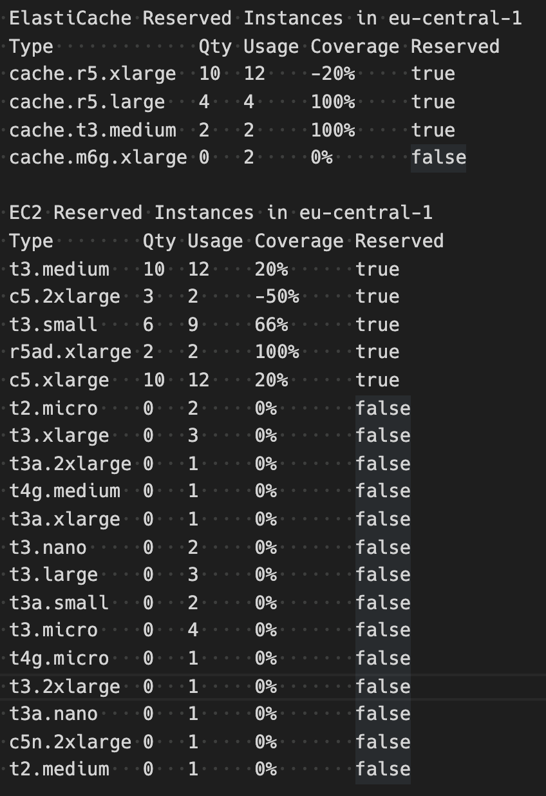

# richeck
This tool allows you to simply see the EC2 and ElastiCache nodes you have reserved on amazon.

Motivation:

How many instances are currently reserved in the regions? and how necessary is it? I wanted to see it simply. The "RI Coverage Report" (https://aws.amazon.com/tr/aws-cost-management/reserved-instance-reporting/) was showing hourly. Seeing the usage and reserved numbers as simple helped me to make a clear decision.


## Usage

> richeck --region=eu-central-1

or

> richeck --json


Output:




## Configuration

* set AWS credentials in `~/.aws/credentials` file

```ini
[default]
aws_access_key_id = A******************U
aws_secret_access_key = WD/**********************************MA
```

or

* set AWS credentials system environment

```bash
export AWS_ACCESS_KEY_ID=A******************U
export AWS_SECRET_ACCESS_KEY=WD/**********************************MA
```

## Policy

```json
{
    "Version": "2012-10-17",
    "Statement": [
        {
            "Effect": "Allow",
            "Action": [
                "ec2:DescribeInstances",
                "ec2:DescribeReservedInstances",
                "elasticache:DescribeCacheClusters",
                "elasticache:DescribeReservedCacheNodes",                
            ],
            "Resource": "*"
        }
    ]
}
```

## License

Distributed under the MIT License. See `LICENSE` for more information.

## Contact

Oğuzhan YILMAZ - [@c1982](https://twitter.com/c1982) - aspsrc@gmail.com